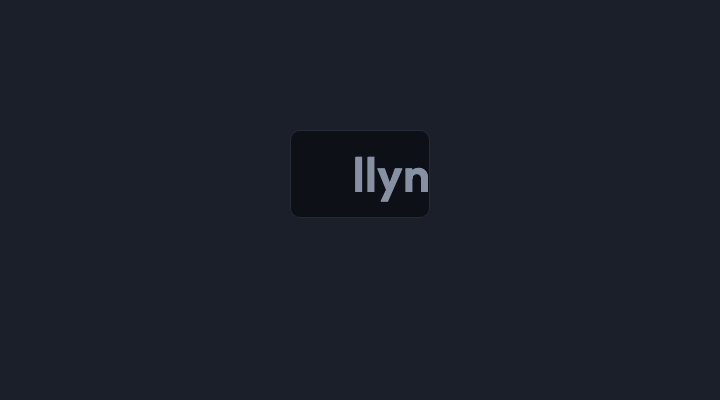

# llynt-skills

Rendered-UI validation for AI-generated code. Catches what linters and code review can't see — the actual browser output.

Built by [llynt](https://llynt.dev) — UI integrity checks in your PR pipeline.



## Install

```
npx skills add llynt/llynt-skills -a claude-code -y
```

## Skills

### ui-check

Spot-check rendered UI in the browser before you ship. Catches the stuff that slips past code review:

- **Tap targets** — Buttons and links smaller than 44x44px (the minimum for comfortable mobile use)
- **Horizontal overflow** — Pages that scroll sideways on mobile, usually from a fixed-width element
- **Broken images** — `` tags that failed to load (invisible if you have cached versions)

Each check runs as a `page.evaluate()` snippet — works with Playwright, Puppeteer, or any browser automation your agent has access to.

**Works with:** Claude Code · Cursor · Copilot · Windsurf · v0 · Bolt

**Usage:** Ask your agent to "check my UI" or "run a ui-check" before merging.

## Why these checks?

AI agents generate UI faster than teams review it. Linters check source. Screenshots need a human. These checks validate what the browser actually renders — structured findings your agent acts on directly. That's the difference between self-verification and externalized verification.

For deeper analysis — contrast ratios, element occlusion, cross-viewport drift, design token conformance — see [llynt.dev](https://llynt.dev).

## License

MIT
