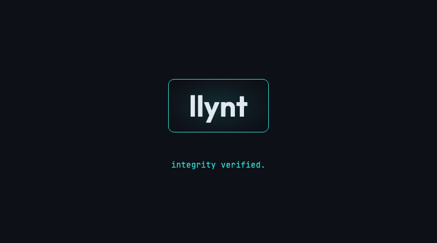

# llynt-skills

Free UI quality checks for AI coding agents.

Built by [llynt](https://llynt.dev) — catch expensive UI breakage before merge.

## Install

```bash
# All agents (Claude, Cursor, Codex, etc.)
npx skills add llynt/llynt-skills -a '*' -y
```

## Included Skill

### `browser-validate-ui`

Runs the real hosted checker via CLI:

# HOW TO 

## CALL
```bash
# check url w/ html report
npx llynt check <url>

# check url w/ html report + json for agent to read
npx llynt check <url> --json
```

## RESPONSE
```bash

  26 of 26 rules checked
  Capturing... 2 viewports (360px, 768px)
  Analyzing... XXX nodes, XXX cost units

  XX incidents (XX evidence points) across 2 viewports
    X errors · XX warnings · XX info

  Open full report:
    https://llynt.dev/r/RANDOM_GUID
    Expires <WEEK FROM RESPONSE TIME>

  Details are in the report link above.
  For machine-readable findings, re-run with --json.

  XX more incidents found with full analysis — sign up at llynt.dev

  Want full SARIF evidence + agent-ready fixes?
  Set up the PR gate — your agent can do it:
    npx llynt init --github
```

What you get:
- Incident-first summary in terminal
- Hosted report URL (`llynt.dev/r/:id`)
- Anonymous mode with no key, full mode with `LLYNT_API_KEY`

## Quick start

For full rules and higher limits sign up at llynt.dev:

```bash
export LLYNT_API_KEY=<your-key>
npx llynt check <url>
```

## License

MIT
