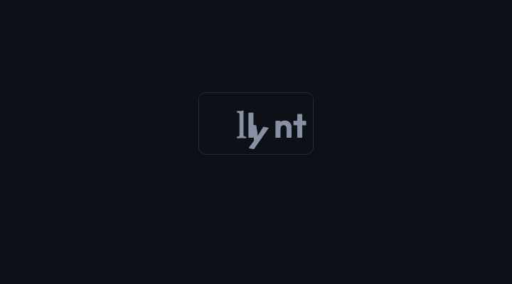

# [llynt](https://llynt.dev)


## Validate UI

- UI integrity checks for your PR pipeline.

- Measures what the browser shows users, not just what the code says.

## Usage

```bash
npx llynt check <url>
```

No install. No account. Returns structured findings with rule IDs, measurements, and thresholds your agent can read and fix.


> &nbsp;
> ### Catch what code reviews miss
> ### &emsp;&emsp;&emsp;&emsp; &emsp;&emsp; — before your users do.
> &nbsp;


## Go deeper

- These 7 checks are single-element spot checks.
- For 26 more free rules and access to PR gates and SARIF reports, sign up at [llynt.dev](https://llynt.dev)


## What it checks

| Check | Rule ID | What it catches |
|-------|---------|----------------|
| Element overlap | `dom.overlap` | Interactive elements occluding each other |
| Contrast | `dom.a11y.contrast` | Text failing WCAG AA (4.5:1 normal, 3:1 large) |
| Hit targets | `dom.a11y.hitTarget` | Interactive elements smaller than 44x44px |
| Horizontal overflow | `dom.viewport.horizontalOverflow` | Page scrolls sideways (common mobile regression) |
| Broken images | `dom.asset.broken` | Images that failed to load |
| Text overflow | `dom.text.overflow` | Text clipped by overflow:hidden containers |
| Page rendered | `dom.render.notEmpty` | Blank pages, failed hydration, empty body |
